# Open Source Preparation Plan
## ChatGPT Image Editing POC - Community-Driven Project

### Project Overview
This is a comprehensive plan to prepare the **ChatGPT Image Editing POC** for public open source release as a community-driven project. The project is a sophisticated AI-powered image editing platform with mask-based editing, multi-provider AI integration, and a modern floating toolbar interface.

### Current Project Status
- **Functionality**: 95% complete with working AI integration (Stability AI, Recraft AI)
- **UI/UX**: 98% complete with modern floating toolbar and edge-to-edge canvas
- **Technical Quality**: 94% complete with clean architecture and TypeScript
- **Security**: Currently POC-level, needs production hardening

## Preparation Strategy

```mermaid
graph TD
    A[Open Source Preparation] --> B[Security & Privacy]
    A --> C[Documentation]
    A --> D[Community Guidelines]
    A --> E[Development Workflows]
    A --> F[Project Structure]
    
    B --> B1[Security Audit]
    B --> B2[Environment Setup]
    B --> B3[Secrets Management]
    
    C --> C1[Enhanced README]
    C --> C2[API Documentation]
    C --> C3[Architecture Docs]
    C --> C4[User Guides]
    
    D --> D1[Contributing Guidelines]
    D --> D2[Code of Conduct]
    D --> D3[Issue Templates]
    D --> D4[PR Templates]
    
    E --> E1[GitHub Actions]
    E --> E2[Testing Framework]
    E --> E3[Code Quality]
    E --> E4[Release Process]
    
    F --> F1[License Selection]
    F --> F2[File Organization]
    F --> F3[Dependency Audit]
```

## Phase 1: Security & Privacy Foundation

### 1.1 Security Audit & Hardening
- **Environment Variables Audit**: Ensure no secrets in codebase
- **Enhanced `.gitignore`**: Add comprehensive exclusions
- **Security Documentation**: Document security considerations
- **Vulnerability Assessment**: Review for common security issues

### 1.2 Environment Setup Enhancement
- **`.env.example`**: Create template with all required variables
- **Environment Validation**: Add startup checks for required variables
- **Docker Support**: Optional containerization for easy setup
- **Security Best Practices**: Document secure deployment patterns

### 1.3 Secrets Management
- **API Key Documentation**: Clear instructions for obtaining keys
- **Provider Setup Guides**: Step-by-step setup for each AI provider
- **Supabase Configuration**: Complete database setup guide
- **Stripe Integration**: Payment setup documentation

## Phase 2: Comprehensive Documentation

### 2.1 Enhanced README
- **Project Overview**: Clear description and value proposition
- **Feature Showcase**: Screenshots and GIFs of key features
- **Quick Start Guide**: Get running in 5 minutes
- **Architecture Overview**: High-level system design
- **Contributing Links**: Direct paths to contribution guides

### 2.2 Technical Documentation
- **API Documentation**: Complete endpoint documentation
- **Component Architecture**: React component structure
- **Provider Pattern**: How to add new AI providers
- **Database Schema**: Supabase table structures
- **Canvas System**: Image editing implementation details

### 2.3 User Documentation
- **User Guide**: How to use the image editor
- **Feature Documentation**: Detailed feature explanations
- **Troubleshooting**: Common issues and solutions
- **FAQ**: Frequently asked questions

### 2.4 Developer Documentation
- **Development Setup**: Complete local development guide
- **Code Style Guide**: Coding standards and patterns
- **Testing Guide**: How to run and write tests
- **Deployment Guide**: Production deployment instructions

## Phase 3: Community Guidelines & Governance

### 3.1 Community Foundation
- **Code of Conduct**: Welcoming, inclusive community standards
- **Contributing Guidelines**: How to contribute effectively
- **Governance Model**: Decision-making process
- **Communication Channels**: Discord/Discussions setup

### 3.2 Issue Management
- **Issue Templates**: Bug reports, feature requests, questions
- **Labels System**: Organized issue categorization
- **Triage Process**: How issues are prioritized
- **Response Guidelines**: Community support standards

### 3.3 Pull Request Process
- **PR Templates**: Structured contribution format
- **Review Guidelines**: Code review standards
- **Merge Criteria**: Requirements for accepting PRs
- **Recognition System**: Contributor acknowledgment

## Phase 4: Development Workflows & Automation

### 4.1 GitHub Actions
- **CI/CD Pipeline**: Automated testing and deployment
- **Code Quality Checks**: ESLint, TypeScript, formatting
- **Security Scanning**: Dependency vulnerability checks
- **Performance Testing**: Automated performance monitoring

### 4.2 Testing Framework
- **Unit Tests**: Component and utility testing
- **Integration Tests**: API endpoint testing
- **E2E Tests**: Full workflow testing
- **Visual Regression**: UI consistency testing

### 4.3 Code Quality
- **ESLint Configuration**: Comprehensive linting rules
- **Prettier Setup**: Consistent code formatting
- **Husky Hooks**: Pre-commit quality checks
- **TypeScript Strict Mode**: Enhanced type safety

### 4.4 Release Management
- **Semantic Versioning**: Clear version strategy
- **Changelog Generation**: Automated release notes
- **Release Process**: Standardized release workflow
- **Migration Guides**: Breaking change documentation

## Phase 5: Project Structure & Legal

### 5.1 License Selection
- **MIT License**: Permissive open source license
- **License Documentation**: Clear usage rights
- **Contributor License**: CLA if needed
- **Third-party Licenses**: Dependency license audit

### 5.2 File Organization
- **Documentation Structure**: Organized docs folder
- **Example Files**: Sample configurations
- **Scripts Organization**: Utility scripts
- **Asset Management**: Public assets organization

### 5.3 Dependency Management
- **Dependency Audit**: Review all dependencies
- **Security Updates**: Automated dependency updates
- **License Compatibility**: Ensure license compatibility
- **Bundle Size**: Optimize for performance

## Implementation Priority

### High Priority (Week 1)
1. **Security Audit**: Remove any potential secrets
2. **Enhanced README**: Professional project presentation
3. **Contributing Guidelines**: Enable community participation
4. **Issue Templates**: Structured community feedback

### Medium Priority (Week 2)
1. **Code of Conduct**: Community standards
2. **API Documentation**: Technical reference
3. **GitHub Actions**: Basic CI/CD
4. **Testing Framework**: Quality assurance

### Lower Priority (Week 3+)
1. **Advanced Documentation**: Comprehensive guides
2. **Performance Optimization**: Production readiness
3. **Advanced Workflows**: Sophisticated automation
4. **Community Building**: Outreach and promotion

## Detailed Implementation Tasks

### Security & Environment Tasks
- [ ] Audit codebase for hardcoded secrets or sensitive data
- [ ] Create comprehensive `.env.example` file
- [ ] Enhance `.gitignore` with security-focused exclusions
- [ ] Add environment variable validation on startup
- [ ] Document security best practices for deployment
- [ ] Create API key setup guides for each provider
- [ ] Document Supabase project setup process
- [ ] Create Stripe webhook configuration guide

### Documentation Tasks
- [ ] Rewrite README with professional presentation
- [ ] Add feature screenshots and demo GIFs
- [ ] Create API endpoint documentation
- [ ] Document React component architecture
- [ ] Write provider pattern implementation guide
- [ ] Create user guide for image editing features
- [ ] Write troubleshooting and FAQ sections
- [ ] Document development setup process

### Community & Governance Tasks
- [ ] Create CODE_OF_CONDUCT.md
- [ ] Write comprehensive CONTRIBUTING.md
- [ ] Create issue templates (bug, feature, question)
- [ ] Create pull request template
- [ ] Set up GitHub Discussions
- [ ] Create contributor recognition system
- [ ] Document governance and decision-making process
- [ ] Set up community communication channels

### Development Workflow Tasks
- [ ] Set up GitHub Actions for CI/CD
- [ ] Configure ESLint and Prettier
- [ ] Add pre-commit hooks with Husky
- [ ] Set up automated testing framework
- [ ] Configure dependency vulnerability scanning
- [ ] Set up automated changelog generation
- [ ] Create release workflow
- [ ] Add performance monitoring

### Project Structure Tasks
- [ ] Organize documentation in `/docs` folder
- [ ] Create `/scripts` folder for utility scripts
- [ ] Set up proper asset organization
- [ ] Audit and document all dependencies
- [ ] Set up automated dependency updates
- [ ] Create Docker configuration (optional)
- [ ] Organize example configurations

## Success Metrics

### Technical Metrics
- **Setup Time**: New contributors can run locally in <10 minutes
- **Test Coverage**: >80% code coverage
- **Documentation Coverage**: All public APIs documented
- **Security Score**: No high/critical vulnerabilities

### Community Metrics
- **Contribution Rate**: Regular community contributions
- **Issue Response Time**: <48 hours for initial response
- **Documentation Quality**: Clear, comprehensive guides
- **Developer Experience**: Positive contributor feedback

## Risk Mitigation

### Security Risks
- **API Key Exposure**: Comprehensive secret scanning
- **Vulnerability Management**: Regular security updates
- **Access Control**: Proper repository permissions

### Community Risks
- **Code Quality**: Automated quality checks
- **Maintainer Burnout**: Clear governance and delegation
- **Scope Creep**: Well-defined project goals

### Technical Risks
- **Breaking Changes**: Semantic versioning and migration guides
- **Performance Issues**: Monitoring and optimization
- **Dependency Issues**: Regular updates and alternatives

## Files to Create/Update

### New Files to Create
- `.env.example` - Environment variable template
- `CODE_OF_CONDUCT.md` - Community standards
- `CONTRIBUTING.md` - Contribution guidelines
- `SECURITY.md` - Security policy and reporting
- `CHANGELOG.md` - Version history
- `docs/` folder with comprehensive documentation
- `.github/ISSUE_TEMPLATE/` - Issue templates
- `.github/PULL_REQUEST_TEMPLATE.md` - PR template
- `.github/workflows/` - GitHub Actions
- `scripts/` - Utility scripts
- `docker-compose.yml` - Optional containerization

### Files to Update
- `README.md` - Complete rewrite for open source
- `.gitignore` - Enhanced security exclusions
- `package.json` - Scripts and metadata
- `tsconfig.json` - Strict TypeScript configuration

## Next Steps

1. **Review and approve this plan**
2. **Switch to Code mode for implementation**
3. **Start with high-priority security and documentation tasks**
4. **Iterate through phases based on priority**
5. **Test with community feedback**

This plan transforms the ChatGPT Image Editing POC into a production-ready, community-driven open source project with comprehensive documentation, security measures, and development workflows that will attract and retain contributors.