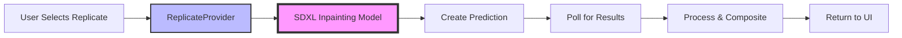
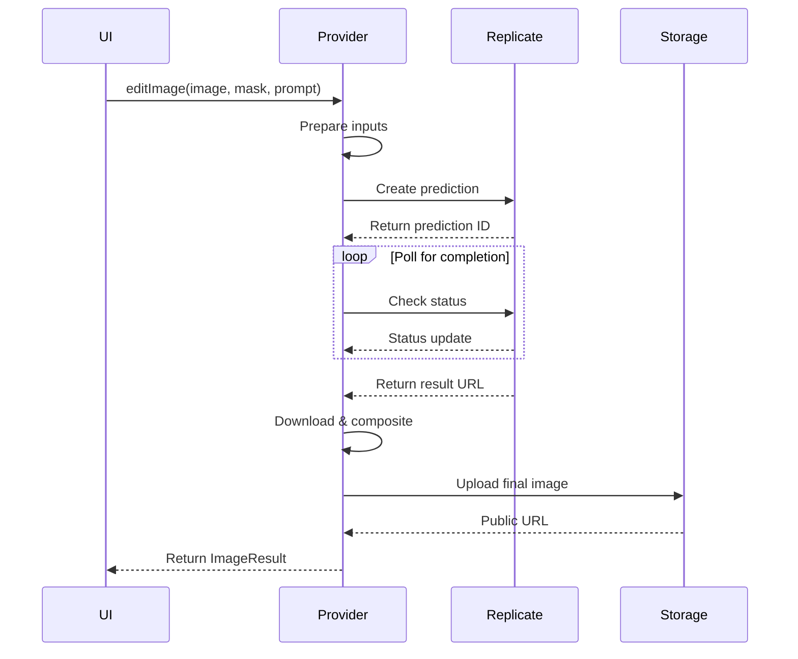

# Replicate.com Integration Plan

## Overview
This document outlines the plan for integrating Replicate.com as a new AI provider in the ChatGPT Image Editing POC. The initial implementation focuses on a single high-quality SDXL inpainting model with the foundation for future expansion.

## Key Advantages of Replicate Integration
1. **Vast Model Selection**: Access to models like SDXL, Flux, ControlNet, and specialized image editing models
2. **Flexible Pricing**: Pay-per-use model without upfront costs
3. **Easy Integration**: Well-documented JavaScript SDK
4. **Specialized Models**: Unique models for specific tasks (inpainting, upscaling, style transfer)

## Architecture Overview



## Implementation Steps

### 1. Install Dependencies
```bash
npm install replicate
```

### 2. Environment Configuration
Add to `.env.local`:
```env
REPLICATE_API_TOKEN=your_replicate_api_token_here
```

### 3. Update Configuration (`lib/config.ts`)
Add Replicate configuration:
```typescript
replicate: {
  name: 'Replicate AI',
  provider: 'replicate' as const,
  endpoint: 'https://api.replicate.com',
  model: 'stability-ai/sdxl:39ed52f2a78e934b3ba6e2a89f5b1c712de7dfea535525255b1aa35c5565e08b',
  apiKey: process.env.REPLICATE_API_TOKEN,
  maxImages: 1,
  maxFileSize: 10 * 1024 * 1024, // 10MB
  supportedFormats: ['png', 'jpeg', 'webp'] as const,
  maskFormat: 'grayscale' as const,
  timeout: 60000, // 60 seconds
}
```

### 4. Create ReplicateProvider (`lib/providers/ReplicateProvider.ts`)
Implement the `ImageProvider` interface with:
- Input validation
- Mask format conversion (white = edit area)
- Prediction creation and polling
- Result compositing
- Supabase storage integration

### 5. Update Factory (`lib/providers/ImageProviderFactory.ts`)
Add Replicate case to the factory:
```typescript
} else if (selectedModel === 'replicate') {
  return new ReplicateProvider();
}
```

## Technical Details

### Replicate API Flow


### Key Implementation Considerations

1. **Async Prediction Model**
   - Replicate uses a prediction queue system
   - Must poll for completion (initial implementation)
   - Future: webhook support for better performance

2. **Input Format for SDXL**
   ```javascript
   {
     image: "base64 or URL",
     mask: "base64 or URL", 
     prompt: "text description",
     num_outputs: 1,
     guidance_scale: 7.5,
     num_inference_steps: 25
   }
   ```

3. **Mask Handling**
   - Convert to grayscale where white = edit area
   - Align with existing mask format from Stability AI implementation

4. **Error Handling**
   - Timeout handling (60 second maximum)
   - Retry logic with exponential backoff
   - Model cold start handling
   - Rate limiting considerations

## Testing Strategy

### Manual Testing Flow
1. Upload test image
2. Draw mask on area to edit
3. Enter prompt
4. Select "Replicate AI" from dropdown
5. Verify result quality and compositing

### Test Scenarios
- Small mask edits
- Large area replacements
- Complex prompts
- Edge cases (very small/large images)
- Timeout scenarios
- Error handling

## Success Criteria
- ✅ Replicate appears in provider dropdown
- ✅ SDXL inpainting model processes images successfully
- ✅ Mask handling works correctly (white = edit area)
- ✅ Results composite properly with original image
- ✅ Error handling for timeouts and failures
- ✅ Integration follows existing provider pattern

## Future Expansion Path
1. **Model Selection**: Add dropdown for multiple Replicate models
2. **Specialized Models**: Integrate upscaling, style transfer models
3. **Performance**: Implement webhook support instead of polling
4. **UI Enhancement**: Show generation progress
5. **Advanced Features**: Expose model-specific parameters

## Implementation Order
1. Create `ReplicateProvider.ts` with basic structure
2. Update `config.ts` with Replicate configuration
3. Update `ImageProviderFactory.ts` to include Replicate
4. Implement core `editImage` method with SDXL
5. Add polling logic for prediction completion
6. Implement compositing logic
7. Add error handling and timeouts
8. Update UI to include Replicate in dropdown
9. Test end-to-end functionality

## Notes
- Initial implementation uses polling for simplicity
- SDXL model chosen for high quality and reliability
- Mask format aligns with existing Stability AI implementation
- Following established provider pattern for consistency